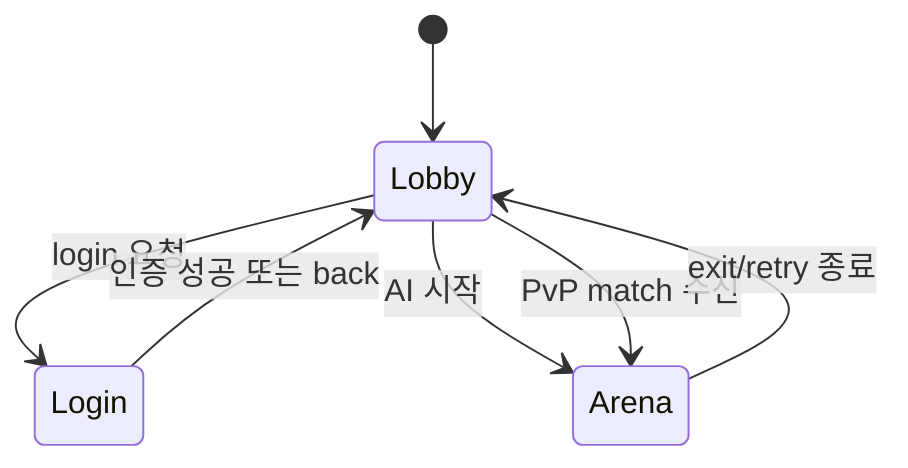
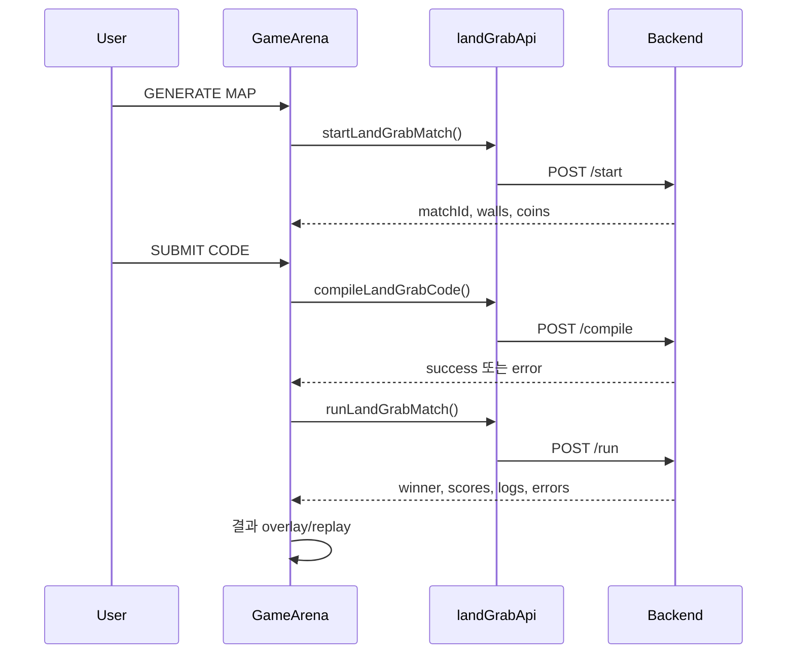

# 프론트엔드 설계

## 역할

프론트엔드는 인증된 브라우저 세션을 복원하고, 로비·로그인·게임 화면을 조합하며, AI REST 흐름과 PvP STOMP 흐름을 사용자 인터랙션으로 연결한다. 게임 규칙이나 승패를 새로 계산하지 않고 백엔드/엔진 결과를 표시한다.

## 코드 구조와 책임

| 위치 | 현재 책임 |
| --- | --- |
| `src/App.jsx` | `lobby/login/arena` 화면 전환, `/me` 세션 복원, OAuth 실패 소비, logout, 선택 난이도와 PvP matchData 전달 |
| `src/LoginPage.jsx` | 로컬 login/signup, guest, Google OAuth 시작과 실패 안내 UI |
| `src/Lobby.jsx` | 게임/난이도 선택, PvP queue socket 연결, join/cancel, 개인 match topic 구독 |
| `src/GameArena.jsx` | AI/PvP 모드 결정, 10분 타이머, Monaco 코드, compile/run/submit, 게임 결과 UI |
| `src/ReplayViewer.jsx` | engine logs의 turn 이동·자동 재생과 Canvas 렌더링 |
| `src/CodeTemplates.js` | 5개 언어 사용자 전략 시작 템플릿 |
| `src/features/auth/authApi.js` | 인증 REST 함수와 Google 로그인 URL |
| `src/features/auth/oauthErrors.js` | OAuth 공개 오류 코드를 사용자 문구로 변환하고 URL query에서 일회성 소비 |
| `src/features/landGrab/landGrabApi.js` | Land Grab start/compile/run REST 함수 |
| `src/features/landGrab/matchOutcome.js` | playerRole과 engine 결과를 VICTORY/DRAW/DEFEAT 표시값으로 변환 |
| `src/shared/api/httpClient.js` | Axios base URL, `withCredentials=true` |
| `src/shared/config/runtime.js` | `VITE_API_BASE_URL`, REST/OAuth/STOMP URL 조립 |
| `src/shared/realtime/createStompClient.js` | SockJS endpoint를 사용하는 STOMP client factory |

## 전역 화면과 상태 흐름

`App`은 router 대신 `view` state로 화면을 전환한다.

브라우저 시작 시 OAuth redirect의 `authError`를 먼저 소비하고 있으면 로그인 화면에서 안내한다. URL의 다른 query/hash는 보존하되 `authError`는 `history.replaceState`로 즉시 제거한다. 이어 `getSession()`을 호출해 성공하면 `isLoggedIn=true`와 `userInfo`를 설정하고, 401 등 실패면 익명 상태를 유지한다. 토큰이나 userId는 localStorage에 저장하지 않는다.

## AI 대전 흐름

AI 사용자는 엔진의 `p1`으로 고정된다. compile 오류면 run을 호출하지 않고 `finished`로 전환한다.

## PvP 흐름

1. `Lobby`가 STOMP client를 만들고 `/topic/match/{userId}`를 구독한다.
2. `/app/match/join`에 `{gameType: "land_grab"}`을 발행한다.
3. match event가 오면 client를 끊고 `App`에 `matchId`, `mapData`, `myRole`을 전달한다.
4. `GameArena`가 새 client로 `/app/game/join`을 발행하고 `/topic/game/{matchId}`를 구독한다.
5. submit은 `{matchId, code, language}`만 전송한다. userId는 쿠키로 인증된 Principal에서 서버가 결정한다.
6. `PLAYER_SUBMITTED`는 상대 준비 상태를 갱신하고 `RESULT|ERROR`는 결과 화면으로 전환한다.

## GameArena 상태

| state | 의미 |
| --- | --- |
| `init` | AI map이 아직 없거나 초기 화면 |
| `ready` | 코드 편집·제출 가능, 600초 timer 동작 |
| `submitted` | PvP 코드를 보냈고 상대/결과를 기다리는 상태 |
| `finished` | 결과 overlay 표시 |
| `replay` | 결과 overlay를 닫고 replay 탐색 |

`loading`은 boolean과 `COMPILING...`/`BATTLE...` 문자열을 함께 사용하는 표시 state다. `isWaitingOpponent`, `opponentSubmitted`, `myRole`은 PvP에만 사용한다.

## Replay 계약

`ReplayViewer`는 `gameData.logs`의 각 항목에서 다음 필드를 사용한다.

- `turn`, `board_size`
- `walls`, `coins`, `board`
- `p1.pos`, `p1.alive`, `p2.pos`, `p2.alive`

Canvas는 500×500 내부 좌표를 사용하며 turn state에 해당하는 snapshot을 매번 다시 그린다. 자동 재생 간격은 200ms다.

## 설정과 외부 경계

- entry는 루트 `index.html` → `src/index.jsx`이며 Vite가 개발 서버와 production bundle을 만든다.
- 단위/컴포넌트 테스트는 Vitest·jsdom을 사용하고 `src/**/*.test.{js,jsx}`만 수집해 Playwright E2E와 분리한다.
- `VITE_API_BASE_URL` 기본값: `http://localhost:8080`
- 모든 Axios 요청은 cookie를 포함한다.
- SockJS endpoint: `{API_BASE_URL}/ws-stomp`
- 프론트에서 JWT를 직접 읽거나 STOMP header로 전달하지 않는다.

## 현재 제약

- `GameArena`에 타이머, 네트워크, 상태, editor, 결과 화면 책임이 여전히 집중되어 있다.
- 화면 전환이 URL router가 아니라 memory state이므로 새로고침/직접 링크 복원이 없다.
- socket reconnect/backoff와 공통 사용자 오류 UI가 없다.
- production browser E2E는 AI guest 흐름만 다루며 두 브라우저 PvP, Google 실제 성공, 시각 회귀는 없다.

이 제약의 후속 작업은 M3 `FE-01`·`FE-02`로 관리한다.
