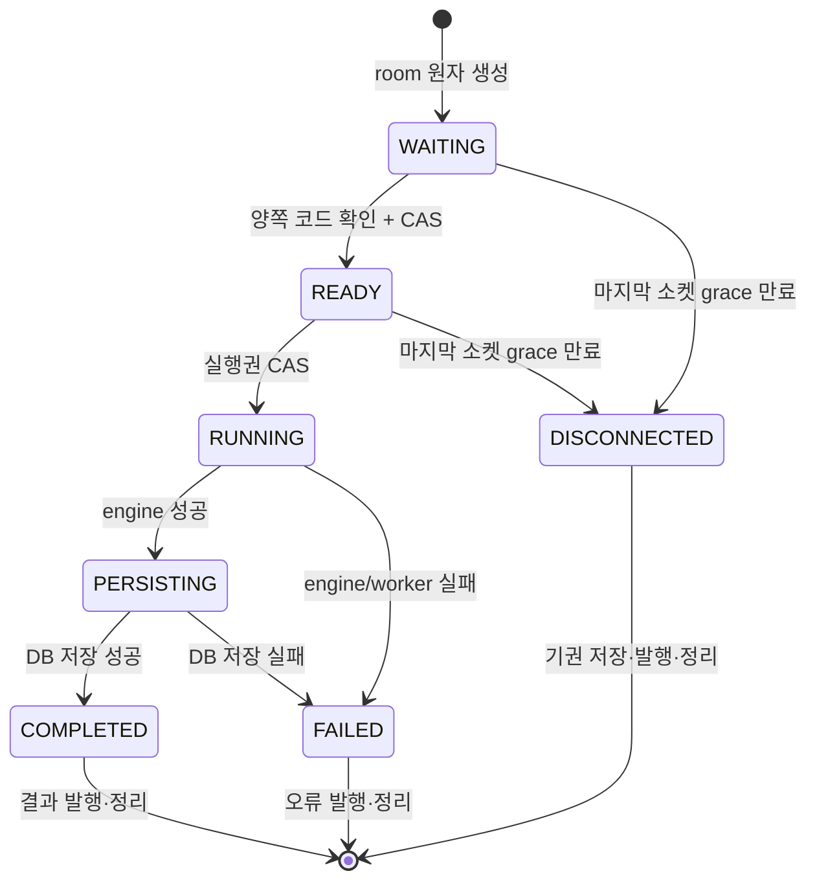

# 실시간 매칭·게임 세션 설계

## 역할

이 영역은 SockJS/STOMP 인증 연결, 사용자별 구독 권한, Redis 대기열과 room 상태, 비동기 코드 실행, 다중 소켓 reconnect와 종료 정리를 담당한다.

## 주요 컴포넌트

| 컴포넌트 | 책임 |
| --- | --- |
| `StompHandler` | CONNECT/SEND/SUBSCRIBE 인증과 topic 접근 제어, 사용자 소켓 등록 |
| `MatchingService` | 대기열 참가·취소, 원자적 pair 예약, room 원자 생성·복귀 |
| `MatchingScheduler` | 주기적 pair 요청, 맵 생성, 매칭 결과 발행 |
| `MatchStateService` | Redis Lua 기반 허용 상태 전이 |
| `GameSessionService` | 제출 조정, 제한된 worker에 실행 위임, 저장·결과·disconnect 처리 |
| `WebSocketEventListener` | 세션 종료 시 사용자/매치 소켓 제거와 마지막 소켓 판정 |
| `MatchExecutionConfig` | bounded 실행 pool과 reconnect grace scheduler |

## STOMP 계약

| 방향 | destination | payload/응답 |
| --- | --- | --- |
| client → server | `/app/match/join` | `{gameType}` |
| client → server | `/app/match/cancel` | `{gameType}` |
| server → client | `/topic/match/{userId}` | matchId, p1Id, p2Id, mapData, myRole |
| client → server | `/app/game/join` | `{matchId}` |
| client → server | `/app/game/submit` | `{matchId, code, language}` |
| server → client | `/topic/game/{matchId}` | `NOTIFICATION`, `RESULT`, `ERROR` |
| server → client | `/user/queue/errors` | STOMP validation `ERROR` |

handshake endpoint는 `/ws-stomp`, publish prefix는 `/app`, simple broker prefix는 `/topic`, `/queue`다. 허용 origin은 `cca.frontend-url` 한 곳이다. HTTP handshake의 JWT Principal을 사용하며 body의 userId는 신뢰하지 않는다.

요청은 record DTO와 Bean Validation을 사용한다. gameType은 `land_grab`, matchId는 UUID, code는 필수·최대 64,000자, language는 지원하는 다섯 값으로 제한한다. 성공·알림·오류도 `MatchSuccessMessage`, `GameNotificationMessage`, `MatchExecutionResultDto`, `GameErrorMessage`로 고정한다.

## 구독 권한

- CONNECT/SEND/SUBSCRIBE에 Principal이 없으면 거부한다.
- `/topic/match/{userId}`는 Principal과 target userId가 같아야 한다.
- `/topic/game/{matchId}`는 room의 p1 또는 p2만 구독할 수 있다.
- 그 밖의 topic 구독은 거부한다.

## Redis 모델

| key | type | 주요 값 | TTL/정리 |
| --- | --- | --- | --- |
| `match_queue:{gameType}` | ZSET | member=userId, score=join epoch ms | cancel/atomic pop |
| `match_reservation:{userId}` | STRING | 생성할 matchId | pair 확정까지 1분 |
| `match_room:{matchId}` | HASH | gameType, p1, p2, mapData, status, code/lang | 30분, 종료 정리 |
| `user_session:{userId}` | STRING | matchId | 30분, 조건부 정리 |
| `websocket_session:{sessionId}` | STRING | userId | 2시간, disconnect 정리 |
| `user_sockets:{userId}` | SET | 모든 STOMP sessionId | 2시간, 마지막 연결 판정 |
| `socket_game:{sessionId}` | STRING | matchId | 30분, 종료 정리 |
| `match_sockets:{matchId}:{userId}` | SET | 해당 매치의 모든 sessionId | 30분, 종료 정리 |

`RedisTemplate`은 key/value/hash를 String으로 직렬화한다. pair pop은 `ZRANGE + reservation + ZREM`, room 생성은 `HSET + EXPIRE + user_session + reservation 제거`, 복귀는 `reservation 제거 + ZADD`를 각각 하나의 Lua script에서 실행한다. 따라서 여러 scheduler 인스턴스가 같은 사용자를 동시에 가져갈 수 없다. queue join도 기존 session/reservation 확인과 `ZADD NX`가 한 script다.

## 상태 머신과 실행 흐름

상태 전이는 `MatchStateService` Lua compare-and-set만 사용한다. 두 제출 요청이 동시에 준비 완료를 관찰해도 `WAITING → READY → RUNNING`을 획득한 요청 하나만 worker에 실행을 넣는다.

STOMP inbound thread는 코드와 상태만 Redis에 기록하고 Docker/DB 작업은 `matchExecutionExecutor`로 넘긴다. 기본 pool은 core 2, max 4, queue 20이며 포화 시 매치를 `FAILED`로 전이하고 고정 오류를 발행한다. 실행 성공은 `RUNNING → PERSISTING → COMPLETED`, 실패는 허용된 현재 상태에서 `FAILED`로 전이한다.

## 다중 소켓과 disconnect

게임 입장 시 사용자별 소켓을 `match_sockets` SET에 추가한다. 한 탭이 닫히면 그 session만 제거하고 다른 session이 남아 있으면 매치를 유지한다. 마지막 session이 사라져도 즉시 기권시키지 않고 기본 5초 grace 뒤 SET을 다시 확인한다. 이 사이 재연결되면 기권은 취소된다.

grace 뒤에도 소켓이 없을 때만 `WAITING|READY → DISCONNECTED` 전이를 시도한다. 이미 `RUNNING`인 매치는 disconnect가 실행 결과를 덮어쓰지 않는다. 정리는 room, 현재 match를 가리키는 user_session, 양쪽 match_sockets와 연결된 socket_game key를 멱등적으로 제거한다.

## 조정 가능한 설정

| 환경 변수 | 기본값 | 의미 |
| --- | --- | --- |
| `MATCH_QUEUE_POLL_INTERVAL` | `1s` | pair 확인 주기 |
| `MATCH_RECONNECT_GRACE` | `5s` | 마지막 매치 소켓 종료 후 대기 |
| `MATCH_EXECUTOR_CORE_SIZE` | `2` | 기본 실행 worker 수 |
| `MATCH_EXECUTOR_MAX_SIZE` | `4` | 최대 실행 worker 수 |
| `MATCH_EXECUTOR_QUEUE_CAPACITY` | `20` | 대기 가능한 실행 수 |

## 현재 제약

- simple broker는 단일 애플리케이션 프로세스 메모리 기반이므로 서버 간 STOMP fan-out은 외부 broker relay가 필요하다.
- reconnect grace 예약은 프로세스 메모리에 있어 해당 서버가 grace 중 재시작되면 예약 작업이 유실될 수 있다.
- Redis script의 실환경 동시성은 REL-01에서 실제 Redis로 다시 검증한다.

후속 네트워크·배포 경계 작업은 [M4](../roadmap/M4-modernization-scale.md)에서 관리한다.
