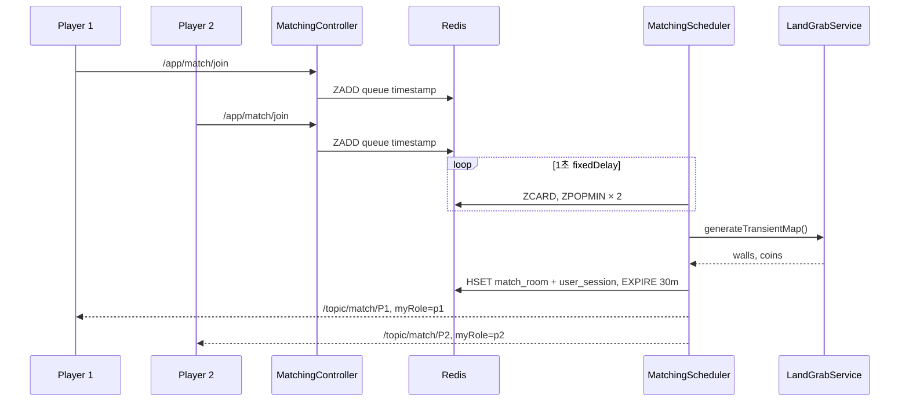
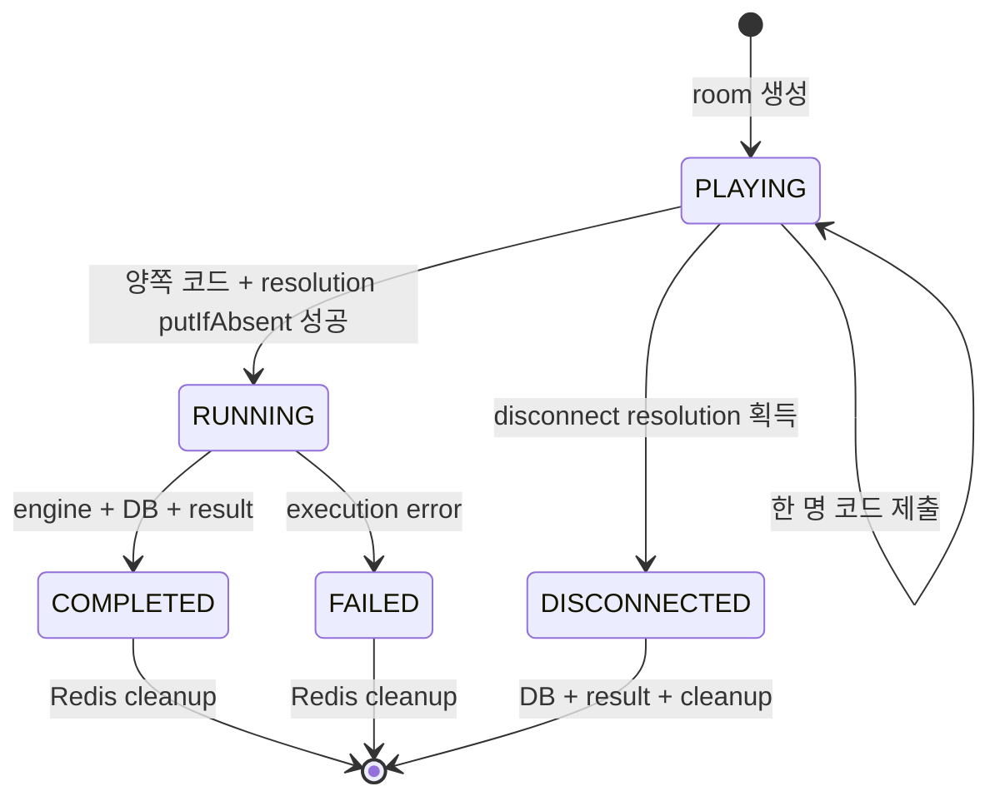

# 실시간 매칭·게임 세션 설계

## 역할

이 영역은 SockJS/STOMP 연결, 사용자별 구독 권한, Redis FIFO 대기열, room 생성, 코드 제출 조정, disconnect 종결과 Redis 정리를 담당한다.

## STOMP 구성

| 항목 | 값 |
| --- | --- |
| handshake endpoint | `/ws-stomp` + SockJS |
| client publish prefix | `/app` |
| simple broker prefix | `/topic`, `/queue` |
| 허용 origin | `cca.frontend-url` 단일 origin |
| inbound interceptor | `StompHandler` |

HTTP handshake에서 JWT cookie가 인증되면 그 `Principal`이 STOMP session에 전달된다. STOMP message body의 userId는 신뢰하지 않는다.

## 메시지 계약

| 방향 | destination | payload/응답 |
| --- | --- | --- |
| client → server | `/app/match/join` | `{gameType}` |
| client → server | `/app/match/cancel` | `{gameType}` |
| server → client | `/topic/match/{userId}` | matchId, p1Id, p2Id, mapData, myRole |
| client → server | `/app/game/join` | `{matchId}` |
| client → server | `/app/game/submit` | `{matchId, code, language}` |
| server → client | `/topic/game/{matchId}` | `NOTIFICATION`, `RESULT`, `ERROR` |
| server → client | `/user/queue/errors` | STOMP validation `ERROR` |

`MatchingController`와 `GameSocketController`는 `Principal.name`을 Long user ID로 사용한다.

client→server payload는 record DTO와 Bean Validation을 사용한다. gameType은 `land_grab`, matchId는 UUID, code는 필수·최대 64,000자, language는 지원하는 5개 값으로 제한한다.

server→client payload도 `MatchSuccessMessage`, `GameNotificationMessage`, `MatchExecutionResultDto`, `GameErrorMessage`로 고정한다. `RESULT`는 `winner`, `final_scores`, `total_turns`, `logs`, `p1_error`, `p2_error`를 사용하고 공개 오류 메시지는 내부 실행 경로와 예외 상세를 노출하지 않는다.

## 구독 권한

`StompHandler`는 다음 규칙을 적용한다.

- CONNECT/SEND/SUBSCRIBE에 Principal이 없으면 거부한다.
- `/topic/match/{userId}`는 Principal과 target userId가 같아야 한다.
- `/topic/game/{matchId}`는 `match_room:{matchId}`의 p1 또는 p2만 구독할 수 있다.
- 정의되지 않은 topic 구독은 거부한다.
- CONNECT 시 `websocket_session:{sessionId}`에 userId를 2시간 저장한다.

## Redis 데이터 모델

| key | type | 주요 값 | TTL/정리 |
| --- | --- | --- | --- |
| `match_queue:{gameType}` | ZSET | member=userId, score=join epoch ms | cancel/pop |
| `match_room:{matchId}` | HASH | gameType, p1, p2, mapData, status, code/lang, resolution | 30분 + 종료 삭제 |
| `user_session:{userId}` | STRING | matchId | 30분 + 종료 삭제 |
| `websocket_session:{sessionId}` | STRING | userId | 2시간 + disconnect 삭제 |
| `socket_game:{sessionId}` | STRING | matchId | 30분 + 종료/disconnect 삭제 |
| `match_socket:{matchId}:{userId}` | STRING | sessionId | 30분 + 종료 삭제 |

`RedisTemplate`은 key/value/hash key/hash value에 모두 String serializer를 사용한다. 복합 map은 service에서 JSON 문자열로 변환한다.

## 매칭 흐름

맵 생성은 최대 3회 시도한다. 실패하면 두 사용자를 원래 ZSET score로 되돌린다.

## 제출과 종결 흐름

실제 Redis `status`는 room 생성 시 `PLAYING`, 실행 획득 시 `RUNNING`을 기록한다. terminal state는 result 전송 후 room 자체를 삭제하므로 Redis에 보존하지 않는다.

`GameSessionService.handleCodeSubmission`은 다음 순서로 동작한다.

1. room과 resolution 유무 확인.
2. Principal user ID를 p1/p2 role로 변환.
3. `{role}_code`, `{role}_lang` 저장.
4. `PLAYER_SUBMITTED` notification 발행.
5. 양쪽 코드가 있으면 hash `resolution=RUNNING`을 `putIfAbsent`로 획득.
6. Docker PvP 실행, DB 저장, result 발행, key cleanup.

## Disconnect

`WebSocketEventListener`는 `SessionDisconnectEvent`에서 다음을 수행한다.

1. `websocket_session`으로 userId 조회.
2. Land Grab queue에서 user 제거.
3. `socket_game`이 있으면 `GameSessionService.handleDisconnection` 호출.
4. disconnect가 resolution을 먼저 획득하면 상대 role을 winner로 저장·발행.
5. session/room 관련 key 정리.

이미 `RUNNING` resolution이 있으면 disconnect가 실행 결과를 덮어쓰지 않는다.

## 현재 제약

- scheduler pair 획득과 room 생성이 다중 서버 환경에서 하나의 원자 연산은 아니다.
- Docker 실행과 DB 저장이 제출 처리 경로에서 동기 실행된다.
- terminal state와 실패 원인이 Redis에 보존되지 않아 장애 후 복구 정보가 부족하다.
- 사용자 다중 탭/다중 소켓과 reconnect grace period가 없다.
- 실 Redis concurrency·disconnect E2E가 없다.

후속 작업은 `MATCH-01`, `MATCH-02`, `MATCH-03`, `REL-01`로 관리한다.
