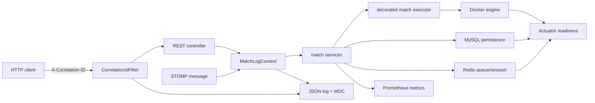

# 관측성·장애 대응 설계

## 역할

관측성 영역은 한 요청과 한 매치의 실행 경로를 JSON 로그로 연결하고, 매칭 적체·엔진 실행·DB 저장·작업공간 정리 상태를 metric과 readiness로 노출한다. 장애를 자동 복구하는 영역은 아니며, 탐지와 원인 범위 축소가 책임이다.



## correlation과 match 추적

- 모든 HTTP 요청은 `X-Correlation-ID`를 받는다. `[A-Za-z0-9._:-]` 128자 이내면 유지하고, 없거나 안전하지 않으면 UUID를 만든다.
- 같은 값을 응답 header로 돌려주며 CORS 노출 header에도 포함한다.
- Log4j2 JSON의 `mdc.correlationId`에서 요청 단위로 검색한다.
- `run`, `compile`, STOMP join/submit, 매칭 생성부터 비동기 실행·저장까지는 `mdc.matchId`를 추가한다.
- 스케줄러처럼 상위 HTTP 요청이 없는 경로는 match ID를 correlation ID로도 사용한다.
- `ThreadPoolTaskExecutor`의 task decorator와 reconnect 작업의 match scope가 작업 thread 전환 뒤에도 문맥을 유지하고 종료 시 이전 thread 문맥을 복원한다.

match ID와 correlation ID는 metric label로 넣지 않는다. 값 종류가 계속 늘어나는 식별자는 로그에만 두고 metric은 `game`, `mode`, `outcome`처럼 제한된 label만 사용한다.

## 구조화 로그

콘솔과 `logs/app.log`는 한 줄에 JSON 객체 하나를 출력한다. 기본 필드는 timestamp, level, logger, thread, message이며 문맥이 있으면 `mdc.correlationId`와 `mdc.matchId`가 추가된다. 예외는 class, message, stacktrace 구조로 기록한다.

운영 로그 검색 순서는 다음과 같다.

1. 사용자 응답의 `X-Correlation-ID` 또는 사용자 제보의 match ID를 확보한다.
2. 동일 `correlationId`로 HTTP 구간을 찾는다.
3. `matchId`로 스케줄러, STOMP, match worker, Docker, 저장 로그를 이어 본다.
4. 같은 시각의 outcome metric과 readiness를 비교해 개별 입력 문제인지 공용 의존성 문제인지 구분한다.

## management endpoint와 readiness

management 서버는 애플리케이션 `8080`과 분리된 `MANAGEMENT_PORT`(기본 `8081`)를 사용한다.

| endpoint | 역할 |
| --- | --- |
| `/actuator/health/liveness` | JVM 애플리케이션 생존 여부 |
| `/actuator/health/readiness` | Spring readiness state, MySQL, Redis, `ENGINE_IMAGE` inspect 종합 |
| `/actuator/prometheus` | Prometheus text format metric |

readiness의 Docker image 검사는 기본 3초 안에 끝나야 하며 `ENGINE_READINESS_TIMEOUT`으로 조정한다. 응답은 component별 UP/DOWN까지 표시하고 command·connection 같은 세부 정보는 숨긴다. management port는 인증 정보를 제공하지 않으므로 인터넷에 노출하지 않고 내부망, sidecar 또는 로컬 scrape 경계에서만 허용한다.

## 애플리케이션 metric

Prometheus 이름은 아래 점 표기 이름이 underscore로 변환되고 counter에는 `_total`이 붙는다.

| 이름 | type | label | 의미 |
| --- | --- | --- | --- |
| `cca.match.queue.events` | counter | game, outcome | join, duplicate, reject, cancel, match, return |
| `cca.match.queue.depth` | gauge | game | 현재 Redis 대기열 크기 |
| `cca.match.creation` | counter | game, outcome | room과 알림 생성 결과 |
| `cca.match.executor.active` | gauge | 없음 | 실행 중 match worker 수 |
| `cca.match.executor.queued` | gauge | 없음 | worker를 기다리는 실행 수 |
| `cca.engine.executions` | counter | game, mode, outcome | success, timeout, output limit, non-zero exit, interrupt, failure |
| `cca.engine.duration` | timer | game, mode, outcome | Docker engine 실행 시간 |
| `cca.match.persistence` | counter | mode, outcome | aggregate 저장 success, duplicate, failure |
| `cca.match.persistence.duration` | timer | mode, outcome | DB aggregate 저장 시간 |
| `cca.workspace.cleanup` | counter | outcome | workspace 삭제·검사 결과 |

모든 metric에는 공통 `application=code-clash-arena` tag가 붙는다.

## 경보 기준

기본 Prometheus rule은 `ops/prometheus/alerts.yml`에 있다.

| alert | 기본 조건 | 우선 확인 |
| --- | --- | --- |
| backend unavailable | scrape 2분 실패 | readiness의 DB, Redis, engine image |
| queue backlog | depth 50 초과 5분 | match creation failure, executor queue |
| engine timeout | 5분 내 1건 이상 | match/correlation 로그, Docker CPU·memory |
| executor backlog | queued 10 초과 2분 | active worker와 engine duration |
| persistence failure | 5분 내 1건 이상 | MySQL 상태, constraint, 동일 match 로그 |
| cleanup failure | 15분 내 1건 이상 | workspace 권한과 디스크 사용량 |

50명, 10건 같은 수치는 초기 운영값이다. 실제 동시 사용자와 정상 p95를 측정한 뒤 환경별 rule에서 조정하되 alert 이름과 runbook 의미는 유지한다.

## 검증

빠른 테스트는 correlation 안전성·문맥 복원, metric 이름과 label, engine health 결과를 검증한다. 실제 인프라에서는 다음 테스트가 MySQL·Redis·Docker image가 모두 준비된 readiness, Prometheus metric, correlation 응답 header를 확인한다.

```powershell
Set-Location backend/code
.\mvnw.cmd "-Dcca.run.integration=true" "-Dtest=ObservabilityIntegrationTest" test
```
