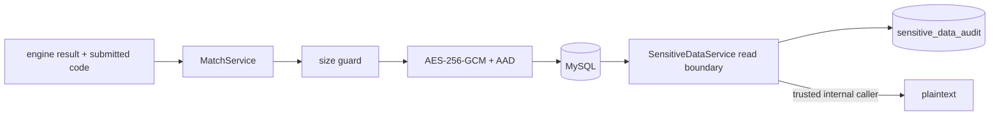

# 민감 데이터 수명 설계

## 역할

이 영역은 매치 제출 코드와 replay를 저장 전에 암호화하고, 복호화 접근을 감사하며, 보존 기간·최대 건수·사용자 요청에 따라 민감 payload만 제거한다. 매치 결과, 점수, 언어, 참가자 관계 같은 비민감 이력은 삭제 대상과 분리한다.

## 주요 컴포넌트

| 컴포넌트 | 책임 |
| --- | --- |
| `SensitivePayloadCipher` | AES-256-GCM envelope 암·복호화, key ID와 이전 키 해석, match/player AAD 검증 |
| `SensitiveDataService` | 저장 크기 제한, 감사되는 복호화 경계, 참가자 요청 삭제 |
| `SensitiveDataMaintenanceService` | 기존 평문 암호화, TTL·최대 건수 batch 삭제, 감사 로그 정리 |
| `SensitiveDataJanitor` | 기동 시 평문 전환 완료, 주기적 정리 batch drain |
| `SensitiveDataAuditService` | 접근·변경 감사 행 저장 |
| `SensitiveDataController` | 인증 사용자의 즉시 삭제 API |
| `SensitiveDataProperties` | 보존·용량·batch·키 설정과 로컬 기본값 |

## 분류와 기본 보존 정책

| 데이터 | 저장 형태 | 기본 보존 | 추가 상한 | 만료 후 |
| --- | --- | --- | --- | --- |
| 제출 코드 | `match_player.submitted_code` AES-GCM envelope | 7일 | 최신 1,000 match | payload를 null로 만들고 `submitted_code_purged_at` 기록 |
| replay | `match_replay.full_log` AES-GCM envelope | 30일 | 최신 1,000 match | replay 행 삭제 |
| 민감 데이터 감사 | `sensitive_data_audit` | 365일 | 100,000행 | 오래된 행부터 삭제 |
| 매치 metadata·결과·점수·언어·참가자 | 평문 domain column | 자동 만료 없음 | 없음 | 유지 |

TTL과 match 수 상한 중 먼저 도달한 조건이 적용된다. 최대 건수는 `game_match.id` 내림차순의 최신 match를 기준으로 하며, 한 번의 조회는 데이터 유형별 기본 500행으로 제한한다. 정리 작업은 기본 10분 간격이고, 같은 batch를 결과가 0이 될 때까지 반복한다.

## 저장과 접근 흐름

- 제출 코드는 UTF-8 기준 262,144 bytes, replay는 1,048,576 bytes를 넘으면 저장하지 않는다.
- envelope 형식은 `cca:v1:{keyId}:{base64url IV}:{base64url ciphertext+tag}`다. 매번 무작위 12-byte IV와 128-bit tag를 사용한다.
- 제출 코드 AAD는 match UUID와 player index, replay AAD는 match UUID를 포함한다. 암호문을 다른 match나 player 행으로 옮기면 인증에 실패한다.
- DB entity나 repository를 직접 사용해 복호화하지 않는다. 향후 조회 기능도 `SensitiveDataService.readSubmittedCode/readReplay`를 통해 actor, 결과, 이유를 감사해야 한다.
- 현재 외부 조회 API는 없다. 저장 이력 화면은 민감 payload를 복호화하지 않으며, 복호화 경계는 운영·후속 조회 기능을 위한 내부 서비스다. read service 자체는 actor 권한을 판정하지 않으므로 향후 controller는 먼저 권한을 확인하고 Principal에서 만든 actor만 전달해야 한다.

AES-GCM 선택과 키·데이터 분리는 [NIST SP 800-38D](https://csrc.nist.gov/pubs/sp/800/38/d/final)와 [OWASP Cryptographic Storage Cheat Sheet](https://cheatsheetseries.owasp.org/cheatsheets/Cryptographic_Storage_Cheat_Sheet.html)의 authenticated encryption·key lifecycle 원칙을 따른다.

## 기존 데이터 전환

Flyway V3는 `submitted_code`를 nullable LONGTEXT로 바꾸고 삭제 시각 column과 감사 table/index를 추가한다. migration SQL은 기존 payload를 직접 암호화하지 않는다.

애플리케이션 기동 후 `SensitiveDataJanitor`가 `cca:v1:` prefix가 없는 제출 코드와 replay를 batch로 찾아 모두 암호화한다. 각 batch는 transaction으로 저장되고 `ENCRYPT_LEGACY` 감사를 남긴다. 전환 도중에도 읽기 서비스는 이전 평문을 반환할 수 있어 순차 배포가 가능하지만, 전환 완료 전 DB backup과 query 권한은 평문 데이터로 취급해야 한다.

## 사용자 요청 삭제

`DELETE /api/match/{matchId}/sensitive-data`는 인증된 사용자가 해당 match 참가자인지 확인한 뒤 다음을 한 transaction으로 처리한다.

1. 요청 사용자에게 속한 제출 코드만 null로 만들고 삭제 시각을 기록한다.
2. 두 참가자의 행동이 섞인 공유 replay 행을 제거한다.
3. 다른 참가자의 제출 코드는 삭제하지 않는다.
4. `USER_REQUEST` 사유와 삭제 건수를 감사한다.

성공 응답은 `{matchId, submittedCodes, replays}`다. 존재하지 않는 match는 404, 참가자가 아닌 사용자는 403, 인증되지 않은 요청은 401이다. DELETE 요청에도 동일-origin 검사가 적용된다. 같은 요청을 반복하면 삭제 건수 0의 성공 응답을 반환한다.

## 키 설정과 교체

| 환경 변수 | 기본값 | 의미 |
| --- | --- | --- |
| `DATA_ENCRYPTION_ACTIVE_KEY_ID` | `local-v1` | 신규 envelope에 기록할 key ID |
| `DATA_ENCRYPTION_KEY` | 개발 전용 32-byte zero key의 Base64 | 활성 AES-256 key |
| `DATA_ENCRYPTION_PREVIOUS_KEYS` | 빈 값 | `oldId=base64Key`의 쉼표 구분 목록 |
| `DATA_LEGACY_MIGRATION_ENABLED` | `true` | 기동 시 기존 평문 전환 |

운영 `prod` profile은 개발 기본 키를 거부한다. 실제 키는 32 random bytes를 Base64로 인코딩해 secret store에서 주입하고 Git, image, 로그, 문서에 기록하지 않는다.

키 교체 절차는 다음과 같다.

1. 새 key ID와 32-byte key를 생성한다.
2. 현재 활성 키를 `DATA_ENCRYPTION_PREVIOUS_KEYS`에 유지한 채 새 키를 active로 배포한다.
3. 신규 저장과 기존 key ID 복호화를 확인한다.
4. 이전 키로 암호화된 payload가 TTL·사용자 삭제로 모두 없어졌음을 확인한 뒤에만 이전 키를 제거한다.

현재 janitor는 평문만 암호화하며 이미 암호화된 envelope를 새 키로 다시 쓰지 않는다. 보존 기간 전에 이전 키를 제거해야 한다면 별도의 재암호화 작업과 검증을 먼저 구현해야 한다.

## 운영 설정

| 환경 변수 | 기본값 |
| --- | --- |
| `DATA_SUBMITTED_CODE_RETENTION` | `7d` |
| `DATA_REPLAY_RETENTION` | `30d` |
| `DATA_AUDIT_RETENTION` | `365d` |
| `DATA_MAX_RETAINED_MATCHES` | `1000` |
| `DATA_MAX_AUDIT_RECORDS` | `100000` |
| `DATA_CLEANUP_BATCH_SIZE` | `500` |
| `DATA_CLEANUP_INITIAL_DELAY` | `1m` |
| `DATA_CLEANUP_INTERVAL` | `10m` |
| `DATA_SUBMITTED_CODE_MAX_BYTES` | `262144` |
| `DATA_REPLAY_MAX_BYTES` | `1048576` |

`DATA_CLEANUP_ENABLED=false`는 장애 조사 같은 제한된 기간에만 사용한다. 비활성화 기간에도 신규 payload는 암호화되지만 TTL·용량·감사 로그 정리가 중단되므로 DB 증가량을 별도로 감시하고 다시 활성화해야 한다.

## 검증 경계와 현재 제한

- H2 schema test가 V3 table/column을, 실제 MySQL smoke가 V3 migrate/validate와 두 감사 index를 확인한다.
- 단위 테스트가 암호문 비결정성, AAD 변조 실패, 이전 키 복호화, 크기 제한, 삭제 권한, legacy/TTL/capacity batch drain을 검증한다.
- 실제 MySQL 통합 테스트가 평문 비노출, 기존 평문 재암호화, 감사되는 복호화, 참가자 즉시 삭제를 확인한다.
- 암호화는 애플리케이션 계정이나 호스트가 침해된 뒤의 복호화를 막지 않는다. DB dump·backup 노출 범위를 줄이는 방어이며 secret store 접근 통제와 키 교체가 함께 필요하다.
- match metadata와 감사 actor는 삭제 후에도 남는다. 계정 전체 삭제·법적 보존 정책은 별도 요구사항으로 설계해야 한다.
