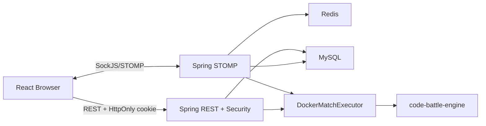

# 현재 코드 설계 문서

- 기준일: 2026-08-19
- 기준 브랜치: `codex/m2-dep-data`
- 성격: 목표 구조가 아니라 현재 코드가 실제로 수행하는 책임과 경계를 설명한다.

## 시스템 개요

Code Clash Arena는 React 브라우저 앱, Spring Boot API/실시간 서버, Redis·MySQL, Docker 기반 코드 실행 엔진으로 구성된다.



## 역할별 문서

| 역할 | 문서 | 주요 소유 책임 |
| --- | --- | --- |
| 프론트엔드 | [01-frontend.md](01-frontend.md) | 화면 전환, 인증 상태, AI/PvP 입력·표시, replay |
| 인증·HTTP API | [02-auth-http-api.md](02-auth-http-api.md) | JWT 쿠키, REST 인증, CORS, 요청·오류 경계 |
| 실시간 매칭·세션 | [03-realtime-match.md](03-realtime-match.md) | STOMP 권한, Redis queue/room/socket, 제출·disconnect |
| 코드 실행·게임 엔진 | [04-code-execution-engine.md](04-code-execution-engine.md) | runner 합성, 작업공간, Docker 격리, Land Grab 규칙 |
| 영속화·운영 | [05-persistence-operations.md](05-persistence-operations.md) | MySQL 모델, 결과/replay 저장, 설정, 로컬 인프라 |
| 테스트·품질 | [06-testing-quality.md](06-testing-quality.md) | 테스트 계층, 실행 명령, 보장 범위와 공백 |
| 관측성·장애 대응 | [07-observability.md](07-observability.md) | correlation ID, JSON 로그, metric, readiness, alert |
| 빌드·의존성 | [08-dependency-build.md](08-dependency-build.md) | 지원 버전, lockfile, 의존성 예외, 정기 갱신 gate |
| 민감 데이터 수명 | [09-sensitive-data-lifecycle.md](09-sensitive-data-lifecycle.md) | 제출 코드·replay 암호화, 보존·삭제, 접근 감사, 키 교체 |
| 네트워크 구성 | [10-network-infrastructure.md](10-network-infrastructure.md) | 배포와 독립적인 OCI subnet·NSG·NAT·Bastion 코드, mock/실환경 검증 구분 |

## 역할 간 의존 방향

```text
frontend pages
  → frontend features
    → frontend shared HTTP/realtime
      → REST/STOMP controllers
        → application services
          → repositories | Redis | execution adapters
            → MySQL | Redis | Docker engine
```

- 브라우저는 DB·Redis·Docker에 직접 접근하지 않는다.
- REST와 STOMP controller는 인증된 사용자 식별자를 Spring `Principal`에서 얻는다.
- 게임 규칙의 원천은 Python 엔진이며 프론트엔드는 엔진 결과를 표시한다.
- 영속 저장은 엔진 결과를 다시 계산하지 않고 winner·score·logs를 매치 모델로 변환한다.
- 현재 구조의 미완료 또는 위험 항목은 이 문서에 목표 형태로 섞지 않고 [`../roadmap`](../roadmap/README.md)에 기록한다.

## 공통 용어

| 용어 | 의미 |
| --- | --- |
| `matchId` | UUID 문자열. REST, Redis, 작업공간, DB `matchUuid`가 공유하는 매치 식별자 |
| `p1`, `p2` | 엔진과 매치 room에서 사용하는 플레이어 역할. AI 대전 사용자는 항상 `p1` |
| room | Redis hash `match_room:{matchId}` |
| state transition | Redis Lua CAS로 `WAITING`부터 terminal 상태까지 한 번만 진행하는 전이 |
| runner | 사용자 전략 함수를 표준 stdin/stdout 프로토콜에 연결하는 언어별 템플릿 |
| replay | 턴별 위치·행동·보드·코인·점수를 담은 engine `logs` 배열 |
